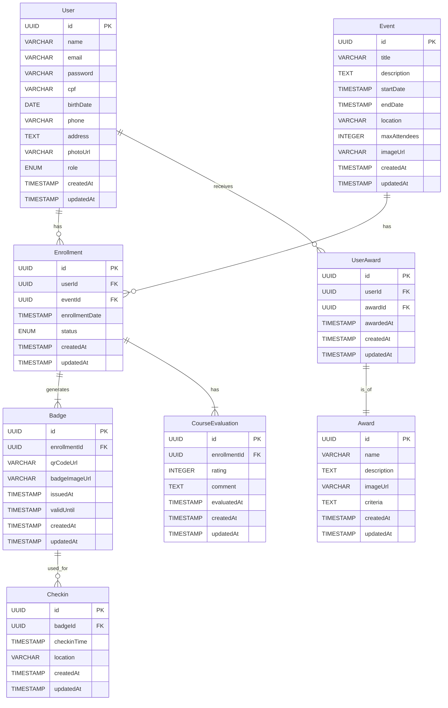

# Documentação da Arquitetura do Sistema de Crachás Virtuais

## 1. Introdução

Este documento detalha a arquitetura proposta para o Sistema de Crachás Virtuais, uma aplicação robusta e escalável projetada para gerenciar o cadastro de usuários, a emissão de crachás virtuais com QR codes para check-ins em eventos, e funcionalidades adicionais como gestão de permissões, inscrição em cursos, relatórios de frequência e gamificação. O objetivo principal é fornecer uma solução integrada que otimize a experiência do usuário em eventos e formações, ao mesmo tempo em que oferece ferramentas administrativas eficientes para os organizadores.

O sistema será desenvolvido utilizando tecnologias modernas e amplamente adotadas no mercado, garantindo alta performance, segurança e manutenibilidade. A escolha das tecnologias foi pautada na experiência do usuário, na facilidade de desenvolvimento e na capacidade de expansão futura. A arquitetura será dividida em três camadas principais: Frontend, Backend e Banco de Dados, cada uma com suas responsabilidades bem definidas e comunicação através de interfaces padronizadas.

Este documento serve como um guia abrangente para o desenvolvimento, manutenção e futuras evoluções do sistema, abordando desde a estrutura tecnológica até os princípios de design e experiência do usuário. Ele é destinado a desenvolvedores, arquitetos de software, gerentes de projeto e qualquer parte interessada que necessite compreender o funcionamento interno e as capacidades do sistema.


## 2. Arquitetura Geral do Sistema

O sistema será construído com uma arquitetura de três camadas, composta por Frontend, Backend e Banco de Dados. Essa abordagem garante modularidade, escalabilidade e separação clara de responsabilidades, facilitando o desenvolvimento e a manutenção. A comunicação entre as camadas será realizada através de interfaces bem definidas, utilizando padrões de mercado para garantir interoperabilidade e segurança.

### 2.1. Frontend

O Frontend será a interface do usuário, responsável por toda a interação visual e pela apresentação dos dados. Será desenvolvido utilizando **React**, uma biblioteca JavaScript declarativa, eficiente e flexível para a construção de interfaces de usuário. A escolha do React se justifica pela sua vasta comunidade, ecossistema robusto de bibliotecas e ferramentas, e sua capacidade de criar Single Page Applications (SPAs) reativas e de alta performance. Para a estilização e componentes de UI, serão utilizadas bibliotecas como Tailwind CSS ou Material-UI, visando uma experiência de usuário consistente e moderna, seguindo os princípios de UI/UX que serão detalhados posteriormente.

### 2.2. Backend

O Backend será o coração do sistema, responsável pela lógica de negócios, autenticação, autorização, manipulação de dados e integração com serviços externos. Será desenvolvido utilizando **Node.js**, um ambiente de execução JavaScript assíncrono e orientado a eventos, ideal para a construção de APIs RESTful escaláveis. A escolha do Node.js permite o uso de JavaScript em todo o stack (full-stack JavaScript), o que otimiza o desenvolvimento e a manutenção. Para a construção da API, será utilizado o framework **Express.js**, conhecido por sua simplicidade e flexibilidade. A comunicação com o banco de dados será gerenciada por um Object-Relational Mapper (ORM), e a preferência é pelo **Prisma**, que oferece uma experiência de desenvolvimento moderna e segura com tipagem forte e migrações de banco de dados eficientes.

### 2.3. Banco de Dados

O Banco de Dados será responsável pelo armazenamento persistente de todos os dados do sistema. Será utilizado o **PostgreSQL**, um sistema de gerenciamento de banco de dados relacional objeto-relacional de código aberto, conhecido por sua robustez, confiabilidade, desempenho e conformidade com padrões SQL. O PostgreSQL é uma escolha excelente para aplicações que exigem integridade de dados, transações complexas e escalabilidade. Ele suporta uma vasta gama de tipos de dados e funcionalidades avançadas, como índices, visões, funções e extensões, que serão exploradas para otimizar o armazenamento e a recuperação de informações.

### 2.4. Comunicação entre Camadas

A comunicação entre o Frontend e o Backend será realizada através de uma **API RESTful**. O Frontend fará requisições HTTP (GET, POST, PUT, DELETE) para os endpoints do Backend, que processará as requisições, interagirá com o banco de dados e retornará as respostas em formato JSON. Essa abordagem desacoplada permite que Frontend e Backend sejam desenvolvidos e implantados de forma independente, aumentando a flexibilidade e a manutenibilidade do sistema. Para garantir a segurança das comunicações, serão implementados mecanismos de autenticação baseados em tokens (e.g., JWT - JSON Web Tokens) e autorização baseada em papéis (RBAC - Role-Based Access Control), além do uso de HTTPS para criptografia do tráfego de dados.


## 3. Detalhamento das Tecnologias

### 3.1. Frontend (React)

*   **React**: Biblioteca JavaScript para construção de interfaces de usuário. Será a base para a criação de componentes reutilizáveis e reativos.
*   **React Router**: Para gerenciamento de rotas na aplicação Single Page Application (SPA), permitindo navegação entre diferentes páginas sem recarregar a página inteira.
*   **Axios**: Cliente HTTP baseado em Promises para fazer requisições ao backend de forma mais organizada e eficiente.
*   **Tailwind CSS / Material-UI**: Frameworks de CSS para estilização e componentes de UI. A escolha final dependerá da preferência por utilitários (Tailwind) ou componentes pré-construídos (Material-UI), visando agilidade no desenvolvimento e um design moderno e responsivo.
*   **Formik / React Hook Form**: Bibliotecas para gerenciamento de formulários, facilitando a validação e o tratamento de estados de formulário.
*   **Yup / Zod**: Bibliotecas para validação de esquemas, integradas com as bibliotecas de formulário para garantir a integridade dos dados inseridos pelo usuário.
*   **Context API / Redux Toolkit**: Para gerenciamento de estado global da aplicação, dependendo da complexidade e da necessidade de escalabilidade do estado.

### 3.2. Backend (Node.js)

*   **Node.js**: Ambiente de execução JavaScript assíncrono e orientado a eventos.
*   **Express.js**: Framework web minimalista e flexível para Node.js, utilizado para construir a API RESTful.
*   **Prisma**: ORM (Object-Relational Mapper) para interagir com o banco de dados PostgreSQL. Oferece tipagem forte, migrações de banco de dados e uma API intuitiva para consultas.
*   **PostgreSQL**: Banco de dados relacional robusto e de código aberto.
*   **bcrypt.js**: Biblioteca para hash de senhas, garantindo a segurança das credenciais dos usuários.
*   **jsonwebtoken (JWT)**: Para geração e verificação de tokens de autenticação, permitindo a comunicação segura entre frontend e backend.
*   **multer**: Middleware para Node.js que facilita o upload de arquivos (como fotos de perfil).
*   **express-validator**: Middleware para validação de dados de entrada nas requisições HTTP.
*   **dotenv**: Para gerenciar variáveis de ambiente, mantendo configurações sensíveis fora do controle de versão.
*   **Nodemailer**: Para envio de e-mails transacionais (e.g., confirmação de cadastro, recuperação de senha).

### 3.3. Banco de Dados (PostgreSQL)

*   **PostgreSQL**: Sistema de gerenciamento de banco de dados relacional objeto-relacional. Será utilizado para armazenar todos os dados do sistema, incluindo informações de usuários, eventos, inscrições, check-ins, crachás, etc.
*   **pgAdmin**: Ferramenta gráfica para administração e gerenciamento de bancos de dados PostgreSQL.

### 3.4. Ferramentas Adicionais

*   **Git**: Sistema de controle de versão para gerenciamento do código-fonte.
*   **Docker**: Para conteinerização da aplicação e do banco de dados, facilitando o desenvolvimento, testes e implantação em diferentes ambientes.
*   **ESLint / Prettier**: Ferramentas para padronização de código e formatação, garantindo a consistência e legibilidade do código.
*   **Jest / React Testing Library**: Para testes unitários e de integração no frontend.
*   **Supertest / Mocha / Chai**: Para testes de integração e end-to-end no backend.
*   **Swagger/OpenAPI**: Para documentação interativa da API RESTful.


## 4. Modelo de Dados (PostgreSQL)

O modelo de dados foi projetado para suportar todas as funcionalidades do sistema, garantindo integridade referencial, escalabilidade e eficiência nas consultas. A seguir, apresentamos as principais entidades e seus atributos, que serão implementadas no banco de dados PostgreSQL. O Prisma ORM será utilizado para gerenciar essas entidades e suas relações.

### 4.1. Entidades Principais

#### `User` (Usuário)
Representa um usuário do sistema, seja ele um participante de evento ou um administrador.

| Campo          | Tipo de Dados      | Restrições        | Descrição                                         |
|----------------|--------------------|-------------------|---------------------------------------------------|
| `id`           | `UUID`             | `PRIMARY KEY`     | Identificador único do usuário.                   |
| `name`         | `VARCHAR(255)`     | `NOT NULL`        | Nome completo do usuário.                         |
| `email`        | `VARCHAR(255)`     | `NOT NULL`, `UNIQUE` | Endereço de e-mail do usuário, usado para login.  |
| `password`     | `VARCHAR(255)`     | `NOT NULL`        | Senha do usuário (hash).                          |
| `cpf`          | `VARCHAR(14)`      | `UNIQUE`          | CPF do usuário (formato: XXX.XXX.XXX-XX).         |
| `birthDate`    | `DATE`             | `NOT NULL`        | Data de nascimento do usuário.                    |
| `phone`        | `VARCHAR(20)`      |                   | Número de telefone do usuário.                    |
| `address`      | `TEXT`             |                   | Endereço completo do usuário.                     |
| `photoUrl`     | `VARCHAR(255)`     |                   | URL da foto de perfil do usuário.                 |
| `role`         | `ENUM('ADMIN', 'USER')` | `NOT NULL`        | Papel do usuário no sistema (administrador ou usuário comum). |
| `createdAt`    | `TIMESTAMP`        | `DEFAULT NOW()`   | Data e hora de criação do registro.               |
| `updatedAt`    | `TIMESTAMP`        | `DEFAULT NOW()`   | Data e hora da última atualização do registro.    |

#### `Event` (Evento/Curso/Formação)
Representa um evento, curso ou formação que os usuários podem se inscrever.

| Campo          | Tipo de Dados      | Restrições        | Descrição                                         |
|----------------|--------------------|-------------------|---------------------------------------------------|
| `id`           | `UUID`             | `PRIMARY KEY`     | Identificador único do evento.                    |
| `title`        | `VARCHAR(255)`     | `NOT NULL`        | Título do evento/curso.                           |
| `description`  | `TEXT`             | `NOT NULL`        | Descrição detalhada do evento.                    |
| `startDate`    | `TIMESTAMP`        | `NOT NULL`        | Data e hora de início do evento.                  |
| `endDate`      | `TIMESTAMP`        | `NOT NULL`        | Data e hora de término do evento.                 |
| `location`     | `VARCHAR(255)`     | `NOT NULL`        | Local onde o evento será realizado.               |
| `maxAttendees` | `INTEGER`          |                   | Número máximo de participantes permitidos.        |
| `imageUrl`     | `VARCHAR(255)`     |                   | URL da imagem de capa do evento.                  |
| `createdAt`    | `TIMESTAMP`        | `DEFAULT NOW()`   | Data e hora de criação do registro.               |
| `updatedAt`    | `TIMESTAMP`        | `DEFAULT NOW()`   | Data e hora da última atualização do registro.    |

#### `Enrollment` (Inscrição)
Registra a inscrição de um usuário em um evento.

| Campo          | Tipo de Dados      | Restrições        | Descrição                                         |
|----------------|--------------------|-------------------|---------------------------------------------------|
| `id`           | `UUID`             | `PRIMARY KEY`     | Identificador único da inscrição.                 |
| `userId`       | `UUID`             | `NOT NULL`, `FOREIGN KEY (User.id)` | Referência ao usuário inscrito.                   |
| `eventId`      | `UUID`             | `NOT NULL`, `FOREIGN KEY (Event.id)` | Referência ao evento.                             |
| `enrollmentDate` | `TIMESTAMP`        | `DEFAULT NOW()`   | Data e hora da inscrição.                         |
| `status`       | `ENUM('PENDING', 'APPROVED', 'CANCELLED')` | `NOT NULL`        | Status da inscrição.                              |
| `createdAt`    | `TIMESTAMP`        | `DEFAULT NOW()`   | Data e hora de criação do registro.               |
| `updatedAt`    | `TIMESTAMP`        | `DEFAULT NOW()`   | Data e hora da última atualização do registro.    |

#### `Badge` (Crachá)
Representa o crachá virtual gerado para um usuário em um evento específico.

| Campo          | Tipo de Dados      | Restrições        | Descrição                                         |
|----------------|--------------------|-------------------|---------------------------------------------------|
| `id`           | `UUID`             | `PRIMARY KEY`     | Identificador único do crachá.                    |
| `enrollmentId` | `UUID`             | `NOT NULL`, `UNIQUE`, `FOREIGN KEY (Enrollment.id)` | Referência à inscrição associada ao crachá.       |
| `qrCodeUrl`    | `VARCHAR(255)`     | `NOT NULL`        | URL do QR Code individual para check-in.          |
| `badgeImageUrl`| `VARCHAR(255)`     | `NOT NULL`        | URL da imagem do crachá virtual.                  |
| `issuedAt`     | `TIMESTAMP`        | `DEFAULT NOW()`   | Data e hora de emissão do crachá.                 |
| `validUntil`   | `TIMESTAMP`        |                   | Data de validade do crachá.                       |
| `createdAt`    | `TIMESTAMP`        | `DEFAULT NOW()`   | Data e hora de criação do registro.               |
| `updatedAt`    | `TIMESTAMP`        | `DEFAULT NOW()`   | Data e hora da última atualização do registro.    |

#### `Checkin` (Check-in)
Registra o check-in de um usuário em um evento, utilizando o QR Code.

| Campo          | Tipo de Dados      | Restrições        | Descrição                                         |
|----------------|--------------------|-------------------|---------------------------------------------------|
| `id`           | `UUID`             | `PRIMARY KEY`     | Identificador único do check-in.                  |
| `badgeId`      | `UUID`             | `NOT NULL`, `FOREIGN KEY (Badge.id)` | Referência ao crachá utilizado para o check-in.   |
| `checkinTime`  | `TIMESTAMP`        | `DEFAULT NOW()`   | Data e hora do check-in.                          |
| `location`     | `VARCHAR(255)`     |                   | Local específico do check-in (e.g., sala, portaria). |
| `createdAt`    | `TIMESTAMP`        | `DEFAULT NOW()`   | Data e hora de criação do registro.               |
| `updatedAt`    | `TIMESTAMP`        | `DEFAULT NOW()`   | Data e hora da última atualização do registro.    |

#### `Award` (Premiação/Badge Gamificada)
Define as premiações e badges gamificadas que os usuários podem receber.

| Campo          | Tipo de Dados      | Restrições        | Descrição                                         |
|----------------|--------------------|-------------------|---------------------------------------------------|
| `id`           | `UUID`             | `PRIMARY KEY`     | Identificador único da premiação.                 |
| `name`         | `VARCHAR(255)`     | `NOT NULL`        | Nome da premiação/badge.                          |
| `description`  | `TEXT`             |                   | Descrição da premiação.                           |
| `imageUrl`     | `VARCHAR(255)`     |                   | URL da imagem da badge.                           |
| `criteria`     | `TEXT`             | `NOT NULL`        | Critérios para receber a premiação (e.g., 


5 check-ins em eventos de tecnologia). |
| `createdAt`    | `TIMESTAMP`        | `DEFAULT NOW()`   | Data e hora de criação do registro.               |
| `updatedAt`    | `TIMESTAMP`        | `DEFAULT NOW()`   | Data e hora da última atualização do registro.    |

#### `UserAward` (Premiação do Usuário)
Registra as premiações e badges que um usuário recebeu.

| Campo          | Tipo de Dados      | Restrições        | Descrição                                         |
|----------------|--------------------|-------------------|---------------------------------------------------|
| `id`           | `UUID`             | `PRIMARY KEY`     | Identificador único da premiação do usuário.      |
| `userId`       | `UUID`             | `NOT NULL`, `FOREIGN KEY (User.id)` | Referência ao usuário que recebeu a premiação.    |
| `awardId`      | `UUID`             | `NOT NULL`, `FOREIGN KEY (Award.id)` | Referência à premiação recebida.                  |
| `awardedAt`    | `TIMESTAMP`        | `DEFAULT NOW()`   | Data e hora em que a premiação foi concedida.     |
| `createdAt`    | `TIMESTAMP`        | `DEFAULT NOW()`   | Data e hora de criação do registro.               |
| `updatedAt`    | `TIMESTAMP`        | `DEFAULT NOW()`   | Data e hora da última atualização do registro.    |

#### `CourseEvaluation` (Avaliação de Curso/Formação)
Registra a avaliação de um usuário sobre um evento/curso.

| Campo          | Tipo de Dados      | Restrições        | Descrição                                         |
|----------------|--------------------|-------------------|---------------------------------------------------|
| `id`           | `UUID`             | `PRIMARY KEY`     | Identificador único da avaliação.                 |
| `enrollmentId` | `UUID`             | `NOT NULL`, `UNIQUE`, `FOREIGN KEY (Enrollment.id)` | Referência à inscrição avaliada.                  |
| `rating`       | `INTEGER`          | `NOT NULL`, `CHECK (rating >= 1 AND rating <= 5)` | Classificação do curso (1 a 5 estrelas).          |
| `comment`      | `TEXT`             |                   | Comentário/feedback do usuário sobre o curso.     |
| `evaluatedAt`  | `TIMESTAMP`        | `DEFAULT NOW()`   | Data e hora da avaliação.                         |
| `createdAt`    | `TIMESTAMP`        | `DEFAULT NOW()`   | Data e hora de criação do registro.               |
| `updatedAt`    | `TIMESTAMP`        | `DEFAULT NOW()`   | Data e hora da última atualização do registro.    |

### 4.2. Relacionamentos entre Entidades

*   **`User` 1:N `Enrollment`**: Um usuário pode ter múltiplas inscrições em eventos.
*   **`Event` 1:N `Enrollment`**: Um evento pode ter múltiplas inscrições de usuários.
*   **`Enrollment` 1:1 `Badge`**: Cada inscrição gera um único crachá virtual.
*   **`Badge` 1:N `Checkin`**: Um crachá pode ser usado para múltiplos check-ins (em diferentes momentos do mesmo evento ou em sessões diferentes).
*   **`User` 1:N `UserAward`**: Um usuário pode receber múltiplas premiações.
*   **`Award` 1:N `UserAward`**: Uma premiação pode ser concedida a múltiplos usuários.
*   **`Enrollment` 1:1 `CourseEvaluation`**: Cada inscrição pode ter uma única avaliação de curso. (Assumindo que um usuário avalia um curso uma única vez por inscrição).

### 4.3. Diagrama de Modelo de Dados (Mermaid ERD)




## 5. APIs RESTful

A comunicação entre o frontend e o backend será realizada através de uma API RESTful bem definida. Esta seção detalha os principais endpoints, métodos HTTP, e os formatos de requisição e resposta esperados para cada funcionalidade do sistema. A API será versionada para garantir compatibilidade futura e será documentada utilizando Swagger/OpenAPI para facilitar o consumo por parte do frontend e de outras aplicações.

### 5.1. Autenticação e Autorização

Todos os endpoints que exigem autenticação e autorização utilizarão JSON Web Tokens (JWT). Após o login, o usuário receberá um token que deverá ser incluído no cabeçalho `Authorization` (como `Bearer <token>`) de todas as requisições subsequentes. A autorização será baseada em papéis (`ADMIN`, `USER`).

#### `POST /api/auth/register`
*   **Descrição**: Registra um novo usuário no sistema.
*   **Requisição**: `application/json`
    ```json
    {
        "name": "Nome Completo",
        "email": "email@example.com",
        "password": "senhaSegura123",
        "cpf": "123.456.789-00",
        "birthDate": "1990-01-01",
        "phone": "(XX) XXXXX-XXXX",
        "address": "Rua Exemplo, 123, Cidade, Estado"
    }
    ```
*   **Resposta**: `201 Created` `application/json`
    ```json
    {
        "id": "uuid-do-usuario",
        "name": "Nome Completo",
        "email": "email@example.com",
        "role": "USER"
    }
    ```

#### `POST /api/auth/login`
*   **Descrição**: Autentica um usuário e retorna um JWT.
*   **Requisição**: `application/json`
    ```json
    {
        "email": "email@example.com",
        "password": "senhaSegura123"
    }
    ```
*   **Resposta**: `200 OK` `application/json`
    ```json
    {
        "token": "jwt-token-gerado",
        "user": {
            "id": "uuid-do-usuario",
            "name": "Nome Completo",
            "email": "email@example.com",
            "role": "USER"
        }
    }
    ```

### 5.2. Gestão de Usuários

#### `GET /api/users`
*   **Descrição**: Retorna uma lista de todos os usuários (requer `ADMIN` role).
*   **Resposta**: `200 OK` `application/json`
    ```json
    [
        { "id": "uuid-do-usuario-1", "name": "Usuario Um", "email": "um@example.com", "role": "USER" },
        { "id": "uuid-do-usuario-2", "name": "Usuario Dois", "email": "dois@example.com", "role": "ADMIN" }
    ]
    ```

#### `GET /api/users/:id`
*   **Descrição**: Retorna os detalhes de um usuário específico.
*   **Resposta**: `200 OK` `application/json`
    ```json
    {
        "id": "uuid-do-usuario",
        "name": "Nome Completo",
        "email": "email@example.com",
        "cpf": "123.456.789-00",
        "birthDate": "1990-01-01T00:00:00.000Z",
        "phone": "(XX) XXXXX-XXXX",
        "address": "Rua Exemplo, 123, Cidade, Estado",
        "photoUrl": "url-da-foto",
        "role": "USER",
        "createdAt": "2023-01-01T10:00:00.000Z",
        "updatedAt": "2023-01-01T10:00:00.000Z"
    }
    ```

#### `PUT /api/users/:id`
*   **Descrição**: Atualiza os dados de um usuário (requer `ADMIN` role ou ser o próprio usuário).
*   **Requisição**: `application/json`
    ```json
    {
        "name": "Novo Nome",
        "phone": "(XX) YYYYY-YYYY"
    }
    ```
*   **Resposta**: `200 OK` `application/json` (usuário atualizado)

#### `DELETE /api/users/:id`
*   **Descrição**: Exclui um usuário (requer `ADMIN` role).
*   **Resposta**: `204 No Content`

#### `POST /api/users/:id/photo`
*   **Descrição**: Faz upload da foto de perfil do usuário.
*   **Requisição**: `multipart/form-data` (com campo `photo` contendo o arquivo da imagem)
*   **Resposta**: `200 OK` `application/json`
    ```json
    {
        "photoUrl": "nova-url-da-foto"
    }
    ```

### 5.3. Gestão de Eventos/Cursos

#### `GET /api/events`
*   **Descrição**: Retorna uma lista de todos os eventos/cursos.
*   **Resposta**: `200 OK` `application/json`
    ```json
    [
        {
            "id": "uuid-do-evento-1",
            "title": "Workshop de React",
            "startDate": "2023-10-26T09:00:00.000Z",
            "location": "Online"
        }
    ]
    ```

#### `GET /api/events/:id`
*   **Descrição**: Retorna os detalhes de um evento/curso específico.
*   **Resposta**: `200 OK` `application/json` (detalhes do evento)

#### `POST /api/events`
*   **Descrição**: Cria um novo evento/curso (requer `ADMIN` role).
*   **Requisição**: `application/json`
    ```json
    {
        "title": "Novo Evento",
        "description": "Descrição do novo evento.",
        "startDate": "2023-11-15T09:00:00.000Z",
        "endDate": "2023-11-15T17:00:00.000Z",
        "location": "Centro de Convenções",
        "maxAttendees": 100,
        "imageUrl": "url-da-imagem-do-evento"
    }
    ```
*   **Resposta**: `201 Created` `application/json` (evento criado)

#### `PUT /api/events/:id`
*   **Descrição**: Atualiza os dados de um evento/curso (requer `ADMIN` role).
*   **Requisição**: `application/json` (dados a serem atualizados)
*   **Resposta**: `200 OK` `application/json` (evento atualizado)

#### `DELETE /api/events/:id`
*   **Descrição**: Exclui um evento/curso (requer `ADMIN` role).
*   **Resposta**: `204 No Content`

### 5.4. Inscrições

#### `POST /api/events/:eventId/enroll`
*   **Descrição**: Permite que um usuário se inscreva em um evento.
*   **Requisição**: `application/json` (corpo vazio ou dados adicionais de inscrição, se houver)
*   **Resposta**: `201 Created` `application/json` (inscrição criada)

#### `GET /api/users/:userId/enrollments`
*   **Descrição**: Retorna todas as inscrições de um usuário.
*   **Resposta**: `200 OK` `application/json` (lista de inscrições)

#### `GET /api/events/:eventId/enrollments`
*   **Descrição**: Retorna todas as inscrições para um evento específico (requer `ADMIN` role).
*   **Resposta**: `200 OK` `application/json` (lista de inscrições)

### 5.5. Crachás e QR Code

#### `GET /api/enrollments/:enrollmentId/badge`
*   **Descrição**: Retorna os detalhes do crachá virtual para uma inscrição específica.
*   **Resposta**: `200 OK` `application/json`
    ```json
    {
        "id": "uuid-do-cracha",
        "qrCodeUrl": "url-do-qrcode",
        "badgeImageUrl": "url-da-imagem-do-cracha",
        "issuedAt": "2023-10-26T10:00:00.000Z",
        "validUntil": null,
        "user": { /* dados do usuário */ },
        "event": { /* dados do evento */ }
    }
    ```

#### `GET /api/enrollments/:enrollmentId/badge/qrcode`
*   **Descrição**: Retorna a imagem do QR Code para o crachá virtual.
*   **Resposta**: `200 OK` `image/png` (imagem do QR Code)

### 5.6. Check-ins

#### `POST /api/checkins`
*   **Descrição**: Realiza um check-in utilizando o QR Code (pode ser usado por um leitor de QR Code ou por um administrador).
*   **Requisição**: `application/json`
    ```json
    {
        "qrCodeValue": "valor-do-qrcode-extraido"
    }
    ```
*   **Resposta**: `201 Created` `application/json` (check-in registrado)

#### `GET /api/events/:eventId/checkins`
*   **Descrição**: Retorna todos os check-ins para um evento específico (requer `ADMIN` role).
*   **Resposta**: `200 OK` `application/json` (lista de check-ins)

#### `GET /api/users/:userId/checkins`
*   **Descrição**: Retorna todos os check-ins de um usuário.
*   **Resposta**: `200 OK` `application/json` (lista de check-ins)

### 5.7. Gamificação (Premiações/Badges)

#### `GET /api/awards`
*   **Descrição**: Retorna uma lista de todas as premiações/badges disponíveis.
*   **Resposta**: `200 OK` `application/json` (lista de premiações)

#### `POST /api/awards`
*   **Descrição**: Cria uma nova premiação/badge (requer `ADMIN` role).
*   **Requisição**: `application/json` (dados da premiação)
*   **Resposta**: `201 Created` `application/json` (premiação criada)

#### `GET /api/users/:userId/awards`
*   **Descrição**: Retorna as premiações que um usuário recebeu.
*   **Resposta**: `200 OK` `application/json` (lista de premiações do usuário)

### 5.8. Avaliação de Cursos

#### `POST /api/enrollments/:enrollmentId/evaluate`
*   **Descrição**: Permite que um usuário avalie um curso/formação após a conclusão.
*   **Requisição**: `application/json`
    ```json
    {
        "rating": 5,
        "comment": "Excelente curso, aprendi muito!"
    }
    ```
*   **Resposta**: `201 Created` `application/json` (avaliação registrada)

#### `GET /api/events/:eventId/evaluations`
*   **Descrição**: Retorna todas as avaliações para um evento específico (requer `ADMIN` role).
*   **Resposta**: `200 OK` `application/json` (lista de avaliações)

### 5.9. Relatórios

#### `GET /api/reports/checkins/:eventId`
*   **Descrição**: Gera um relatório de check-ins para um evento específico (requer `ADMIN` role).
*   **Resposta**: `200 OK` `application/json` (dados do relatório de check-ins)

#### `GET /api/reports/frequency/:eventId`
*   **Descrição**: Gera um relatório de frequência para um evento específico (requer `ADMIN` role).
*   **Resposta**: `200 OK` `application/json` (dados do relatório de frequência)

#### `GET /api/reports/ranking`
*   **Descrição**: Gera um ranking de frequência geral com premiações (requer `ADMIN` role).
*   **Resposta**: `200 OK` `application/json` (dados do ranking)


## 6. Princípios de UI/UX

Para garantir uma experiência de usuário intuitiva, agradável e eficiente, o sistema será desenvolvido seguindo as melhores práticas de User Interface (UI) e User Experience (UX). O foco será na clareza, simplicidade, acessibilidade e consistência em todas as interações.

### 6.1. Design Responsivo

O sistema será totalmente responsivo, adaptando-se a diferentes tamanhos de tela e dispositivos (desktops, tablets e smartphones). Isso garantirá que os usuários possam acessar e interagir com a aplicação de qualquer lugar, a qualquer momento, sem comprometer a usabilidade. A abordagem *mobile-first* será adotada, priorizando o design e a funcionalidade para dispositivos móveis e, em seguida, escalando para telas maiores.

### 6.2. Consistência Visual e Interativa

Será estabelecido um guia de estilo (Style Guide) que definirá a paleta de cores, tipografia, ícones, espaçamentos e componentes de UI. Isso garantirá uma identidade visual coesa e consistente em toda a aplicação. A consistência se estenderá também às interações, com elementos clicáveis e ações se comportando de maneira previsível, reduzindo a curva de aprendizado do usuário.

### 6.3. Clareza e Simplicidade

A interface será projetada para ser clara e direta, evitando informações desnecessárias ou elementos que possam causar distração. O fluxo de usuário será otimizado para que as tarefas principais (cadastro, inscrição em eventos, visualização do crachá) possam ser concluídas com o mínimo de passos possível. Linguagem simples e objetiva será utilizada em todos os textos e mensagens do sistema.

### 6.4. Feedback Visual e Imagens

O sistema fornecerá feedback visual claro para todas as ações do usuário. Por exemplo, ao clicar em um botão, o usuário verá um estado de carregamento ou uma mensagem de sucesso/erro. Imagens e ícones serão utilizados de forma estratégica para enriquecer a experiência visual, facilitar a compreensão e tornar a interface mais atraente, sempre com atenção à otimização para carregamento rápido.

### 6.5. Acessibilidade

O design levará em consideração os princípios de acessibilidade (WCAG - Web Content Accessibility Guidelines), garantindo que o sistema possa ser utilizado por pessoas com diferentes habilidades. Isso inclui o uso de contraste adequado de cores, tamanhos de fonte legíveis, navegação por teclado, descrições alternativas para imagens e compatibilidade com leitores de tela.

### 6.6. Otimização de Performance

As interfaces serão otimizadas para carregamento rápido e fluidez nas interações. Isso inclui a otimização de imagens, o carregamento assíncrono de dados, a minimização de requisições ao servidor e o uso eficiente de cache. Uma aplicação rápida contribui significativamente para uma boa experiência do usuário.

### 6.7. Design de Formulários

Os formulários serão projetados para serem fáceis de preencher, com validação em tempo real, mensagens de erro claras e sugestões úteis. Campos obrigatórios serão claramente indicados, e a ordem dos campos seguirá uma lógica natural. Para o upload de fotos, será oferecida uma experiência intuitiva, com pré-visualização da imagem antes do envio.

### 6.8. Gamificação e Engajamento

As funcionalidades de gamificação (badges, ranking de frequência) serão integradas de forma a motivar e engajar os usuários. O design das badges será visualmente atraente, e o ranking será apresentado de forma clara e competitiva, incentivando a participação contínua nos eventos.

### 6.9. Crachá Virtual e QR Code

O crachá virtual será projetado para ser funcional e esteticamente agradável, exibindo as informações essenciais do usuário e do evento de forma clara. O QR Code no verso será facilmente acessível e escaneável, garantindo um processo de check-in rápido e sem atritos. A integração com carteiras digitais (Apple Wallet, Google Wallet) será pensada para uma experiência de usuário moderna e conveniente, replicando a facilidade de uso de passes de embarque ou ingressos digitais.


